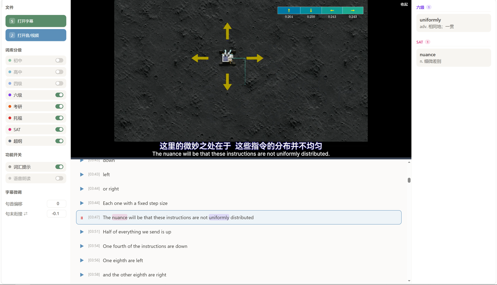

# SubTap · 字幕点读器



> 点读式英语学习工具 —— 载入字幕 + 音视频，点任意句子播放对应片段，内置分级词库给生词按难度着色。先读句、再点听，主动学英语。

## 开发动机

市面上的英语听力软件和方法，大多是「听课式」：播放一大段音频，配上译文和单词解释，让学生被动地听。可一旦被动连听几分钟，大脑几乎不可避免地走神——甚至只要连续出现两三句有难度的句子、中间又没留思考时间，注意力就会涣散、打起瞌睡，学习效果很差。

SubTap 想换一种方式：**主动点读**。每一句都要你主动点一下才会读，句与句之间留出充足的思考时间；遇到生词、难句，旁边就有释义。把被动听变成 **主动读、主动听** ，让注意力始终在线。

学习材料也不挑：美剧、演讲、YouTuber 的视频，从网上下载到本地就行；字幕可以下载现成的，也可以用同属作者开发的 [CapsWriter-Offline](https://github.com/HaujetZhao/CapsWriter-Offline) 离线转录出高质量、带时间戳的字幕。


## 特性

- **点读播放** —— 点了才读，读完暂停，不点就不读
- **语音朗读** —— 没有音视频时，可开启浏览器语音朗读点句发音（可选语言 / 声音 / 语速）
- **分级词库** —— 内置 7 级约 34000 词（初中 / 高中 / 四级 / 六级 / 考研 / 托福 / SAT），按难度给句中生词着色，右栏列出释义
- **多格式字幕** —— SRT / VTT / ASS / SSA / SUB / SBV / SMI（经 [subsrt](https://github.com/papnkukn/subsrt) 解析）
- **字幕微调** —— 句首偏移校准；句末两种纠偏方式「句末偏移 ↔ 句末衔接」
- **纯前端单文件** —— 单 HTML 文件，可离线双击打开，也可托管到 GitHub Pages

## 用法

**直接用**（任选其一）：

- 在线用：访问 [SubTap Pages](https://haujetzhao.github.io/SubTap/)
- 离线用：或下载 [SubTap.html](https://github.com/HaujetZhao/SubTap/releases/latest/download/SubTap.html)，双击打开

**本地开发**：

```bash
npm install
npm run dev      # http://localhost:5173
npm run build    # 产出单文件 dist/index.html
```

## 快捷键

| 键 | 作用 |
|---|---|
| `↑` / `↓` | 上一句 / 下一句 |
| `←` | 重读当前句 |
| `→` / `空格` | 停止播放 |


