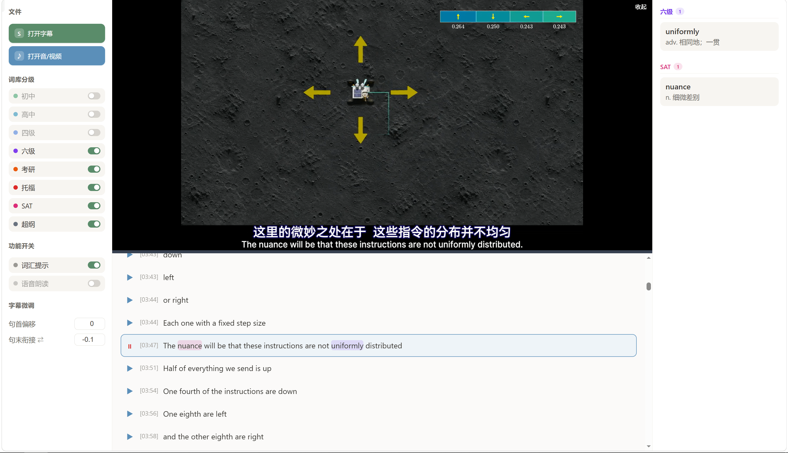

# SubTap · 字幕点读器



点读式英语学习工具 —— 载入字幕 + 音视频，点任意句子播放对应片段，内置分级词库给生词按难度着色。先读句、再点听，主动学英语。

[点击即用](https://haujetzhao.github.io/SubTap/)


## 特性

- **点读播放** —— 点了才读，读完暂停，不点就不读
- **语音朗读** —— 没有音视频时，可开启浏览器语音朗读点句发音（可选语言 / 声音 / 语速）
- **分级词库** —— 内置 7 级约 34000 词（初中 / 高中 / 四级 / 六级 / 考研 / 托福 / SAT），按难度给句中生词着色，右栏列出释义，点击展开词源分析，视频全屏左滑唤出生词栏
- **多格式字幕** —— SRT / VTT / ASS 
- **字幕微调** —— 句首偏移校准；句末两种纠偏方式「句末偏移 ↔ 句末衔接」
- **VAD 自动分段** —— 只有音频没有字幕？内置 VAD 模型自动把音频切成逐句分段，直接点读
- **可安装 / 可离线** —— 在线版是 PWA，可装到桌面/主屏、断网可用；离线版是单 HTML 文件，双击即开


## 设计哲学


SubTap 否定常见的语言学习假设「把知识从教材里提取出来，反复复习，直到记住」，而认为语言学习是：**在大量不同语境中不断遭遇语言，在真实困难处停下来，把输入加工到能听懂，再继续向前。**

### 泛化语言能力，而非背卡片

反复背单词卡片，训练的目标函数是「卡片 → 回忆答案」，容易对卡片内容过拟合；而现实要求「连续声音 → 极短时间内完成语音分割、词汇识别、句法解析、语义整合」。很多英语学习者不缺词汇，缺的是「已经认识的词在真实语流中的组织方式」。

传统教材把语言拆得很碎：单词、句型、语法、练习、对话。而一个视频天然同时提供词汇、句法、发音、语气、上下文、语用、文化背景，且真实存在于一个连续场景中。你学的不是某个英语句子，而是英语在真实环境里是怎么工作的。

### 主动推进，而非被动收听

市面上的听力软件大多是「听课式」：连放一大段音频让学生被动地听。可一旦被动连听几分钟，大脑几乎不可避免地走神——甚至只要连续出现两三句有难度的句子、中间又没留思考时间，注意力就会涣散、打起瞌睡。「一句一句点」把真实听力拆成一个由用户掌控的循环「听 → 判断是否理解 → 遇到障碍 → 停下来 → 阅读 → 再听 → 听懂 → 继续」：每一句都要你主动点一下才读，句与句之间留出充足的思考时间，遇到生词、难句旁边就有释义——注意力始终在线。

### 内容由用户选择

传统学习 App 隐含假设「学习内容应该被产品筛选」，第 1 课 → 第 2 课 → 第 3 课……用户学的是「产品认为有用的英语」，而不是「自己真正想理解的英语」。但真实动机往往是「我特别想看懂这个访谈 / 这个博主 / 这部剧」。SubTap 的逻辑是：**你去找你真正想看的英语，我帮你把它学透**——自己选择学什么，本身就是学习动力的一部分。

> 学习材料不挑：美剧、演讲、YouTuber 的视频，从网上下载到本地就行；字幕可以下载现成的，也可以用同属作者开发的 [CapsWriter-Offline](https://github.com/HaujetZhao/CapsWriter-Offline) 离线转录出高质量、带时间戳的字幕。


### 克制的工具，而非依赖的产品

商业 App 不断加课程、等级、勋章、统计、排行榜、每日任务，想办法让用户每天回来、打卡、不要流失；学习本身容易沦为产品功能的附属品。SubTap 不人为制造课程和任务：把你真正想看的内容拿过来，让你在真正听不懂的地方停下来，弄懂这一句，再继续。它不把语言压缩成卡片、不拆成规定动作，而是把用户丢到真实英语里，只在他真正卡住的地方提供一点帮助。理想状态是：**用户越来越不需要它。**


## 用法

**直接用**（任选其一）：

- 在线用：访问 [SubTap Pages](https://haujetzhao.github.io/SubTap/)（PWA，支持安装到桌面 / 离线使用）
- 离线用：或下载 [SubTap.html](https://github.com/HaujetZhao/SubTap/releases/latest/download/SubTap.html)，双击打开

**本地开发**：

```bash
npm install
npm run dev          # 开发服务器 http://localhost:5173
npm run build        # 产出单文件 dist/index.html(给 Release)
npm run build:pwa    # 产出 PWA 多文件 dist/(给 GitHub Pages,含 service worker)
npm run preview      # 配合 build:pwa 本地预览 PWA(http://localhost:4173)
```

> 在线版（PWA）与离线版（单 HTML）是两套构建：PWA 的 service worker / manifest 必须独立外链、无法内联进单文件，故拆两个 vite 配置。PWA 只能 `build:pwa` 后用 `preview` 验证，`dev` 不生成 service worker。

## 快捷键和手势

| 键 | 作用 |
|---|---|
| `↑` / `↓` | 上一句 / 下一句 |
| `←` | 重播 |
| `→`  | 停止 |
| `空格` | 停止 / 重播 |
| `回车` | 全屏 |
| `[` / `]` | 收起左 / 右边栏 |
| `F` / `双击视频` | 收起 / 展开视频 |


| 手势 | 作用 |
|---|---|
| 双指上滑 | 下一句 |
| 双指下滑 | 上一句 |
| 双指轻点 | 停止 / 重播 |

